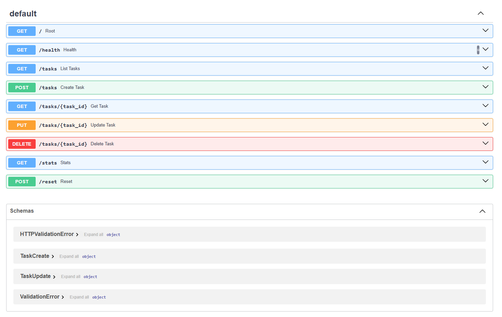
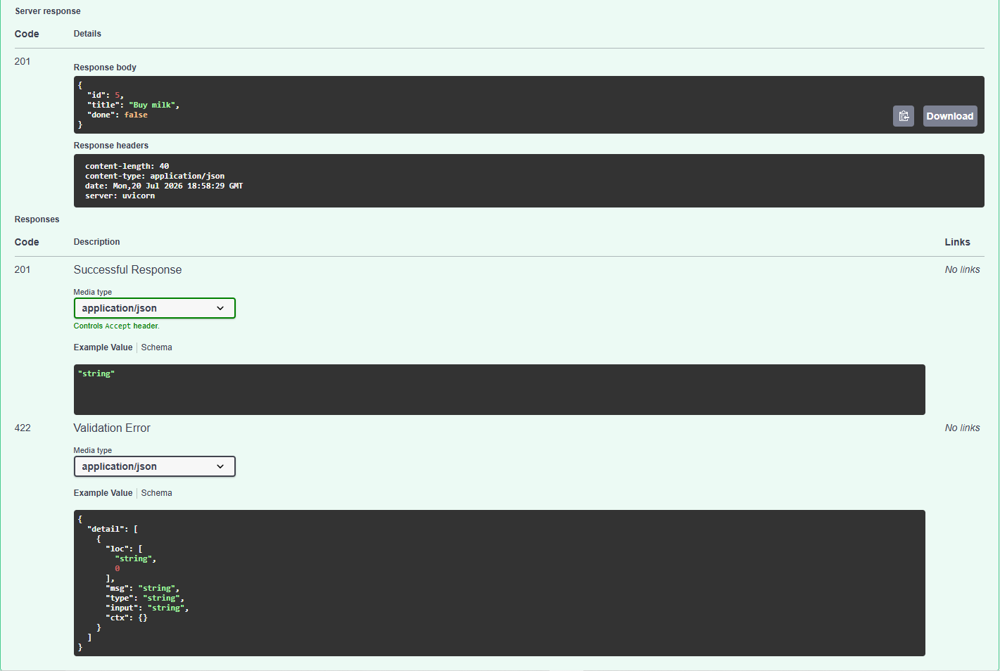
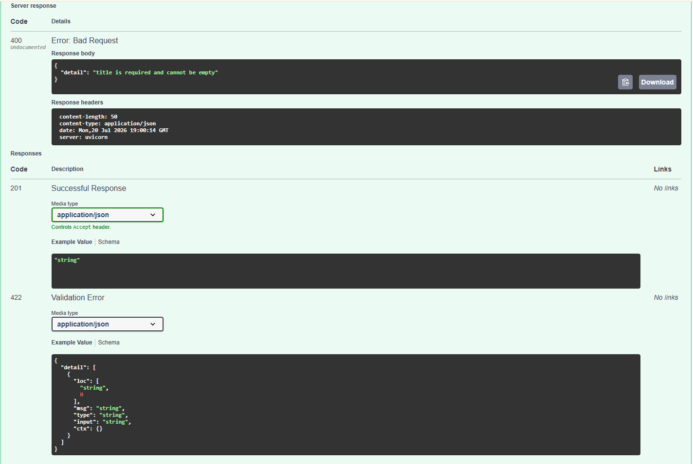
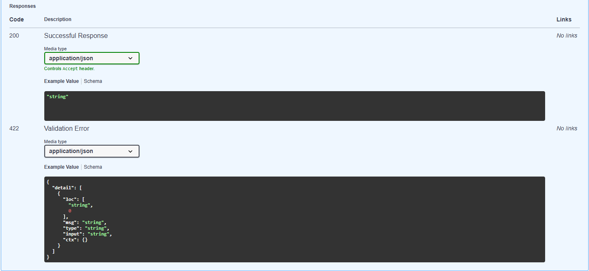
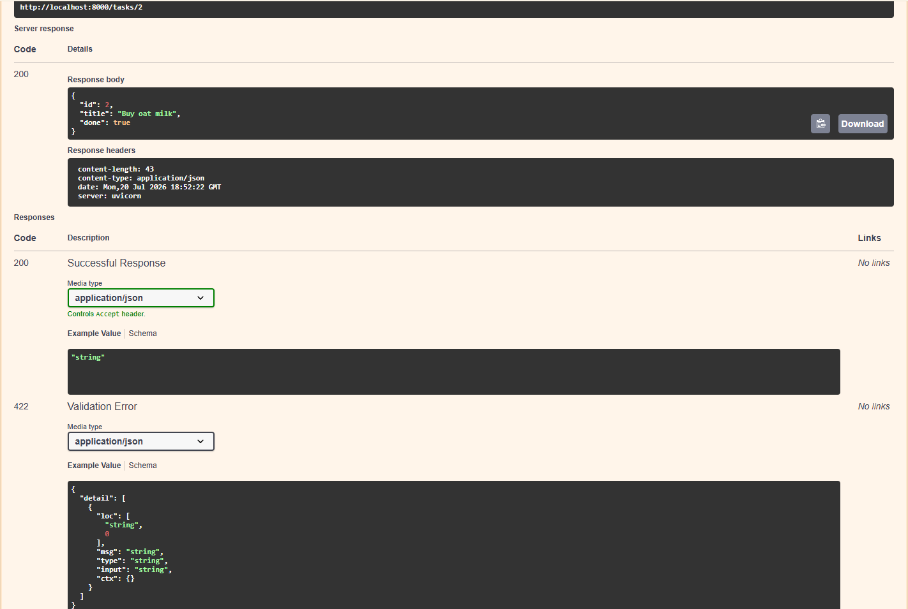
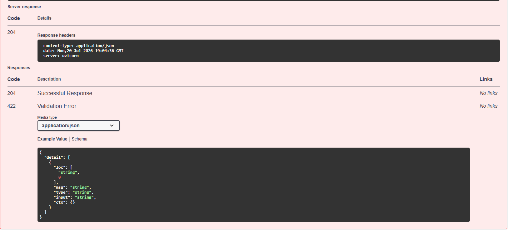

# Task API

A small CRUD API for managing a to-do list, built with FastAPI. Data is stored in a SQLite database (`tasks.db`) — it survives server restarts.

## Run it

```bash
python -m venv venv
venv\Scripts\activate        # Windows
pip install fastapi uvicorn
uvicorn main:app --port 8000 --reload
```

The first run automatically creates `tasks.db` in this folder, creates the `tasks` table if it doesn't exist, and seeds 3 example tasks only if the table is empty.

Then open:
- API root: http://localhost:8000/
- Interactive docs (Swagger UI): http://localhost:8000/docs

## Why SQLite

- Single file (`tasks.db`), zero setup — no separate database server to install or run.
- Perfect for a small project like this, where the whole point is proving persistence works, not scaling to production traffic.
- The database file is git-ignored, so every clone of this repo starts fresh with its own `tasks.db`, created automatically on first run.

## Endpoints

| Method | Path              | Description                          | Success | Errors  |
|--------|-------------------|---------------------------------------|---------|---------|
| GET    | `/`               | API description                       | 200     | —       |
| GET    | `/health`         | Health check                          | 200     | —       |
| GET    | `/tasks`          | List all tasks (supports `?done=` and `?search=`) | 200 | — |
| POST   | `/tasks`          | Create a task (`{"title": "..."}`)    | 201     | 400 (missing/empty title) |
| GET    | `/tasks/{id}`     | Get one task                          | 200     | 404 (not found) |
| PUT    | `/tasks/{id}`     | Update a task's title and/or done     | 200     | 400, 404 |
| DELETE | `/tasks/{id}`     | Delete a task                         | 204     | 404 |
| GET    | `/stats`          | Task counts (`total`, `done`, `open`) | 200     | — |
| POST   | `/reset`          | Reset to the 3 seed tasks             | 200     | — |

All CRUD operations use parameterized SQL queries (`?` placeholders) — no user input is ever glued directly into a SQL string.

## Example request

```
curl -i -X POST http://localhost:8000/tasks -H "Content-Type: application/json" -d "{\"title\":\"Buy milk\"}"
```

```
HTTP/1.1 201 Created
content-type: application/json

{"id":4,"title":"Buy milk","done":false}
```

## Persistence verified

- Restarted the server 3 times after seeding — task count stayed at exactly 3, no duplicates (Stage 0).
- `GET /tasks` and `GET /tasks/999` confirmed reading live from `tasks.db`, with 200 and 404 as expected (Stage 1).
- Created a task via `POST /tasks`, restarted the server, and confirmed it was still present via `GET /tasks` (Stage 2) — the first time data has survived a restart in this project.
- Created, updated (`PUT`), and deleted (`DELETE`) a task, restarted the server, and confirmed the delete held — the task did not reappear (Stage 3).

## Swagger UI

All endpoints listed and testable via "Try it out":



Full CRUD cycle tested through Swagger UI, including validation and error handling:

**Create (201)**


**Create with missing title (400)**


**Read unknown id (404)**


**Update (200)**


**Delete (204)**


## Extras implemented

Beyond the required CRUD endpoints, this API also includes:
- Filtering: `GET /tasks?done=true` (SQL `WHERE done = ?`)
- Search: `GET /tasks?search=milk` (SQL `LIKE`)
- Stats: `GET /stats` → task counts, computed with SQL `COUNT(*)`
- Seed reset: `POST /reset` → restores the 3 example tasks

## Notes

- Data now lives in `tasks.db` — restarting the server no longer wipes it. Call `POST /reset` any time to restore the 3 seed tasks.
- FastAPI's default validation returns 422 for missing required fields. Since the spec asks for 400 on invalid input, `title` is defined as optional in the schema and validated manually in the route, so a missing/empty title returns 400 instead of FastAPI's default 422.
- Error responses use the key `"detail"` (e.g. `{"detail": "Task 99 not found"}`), which is FastAPI's default convention for `HTTPException` — functionally the same as the `"error"` key shown in the assignment spec.

## AI vs me (Stage 7 bonus)

See [ai-version/ai-vs-me.md](ai-version/ai-vs-me.md) for the full comparison between my hand-built API and an AI-generated version, including the rematch result.
