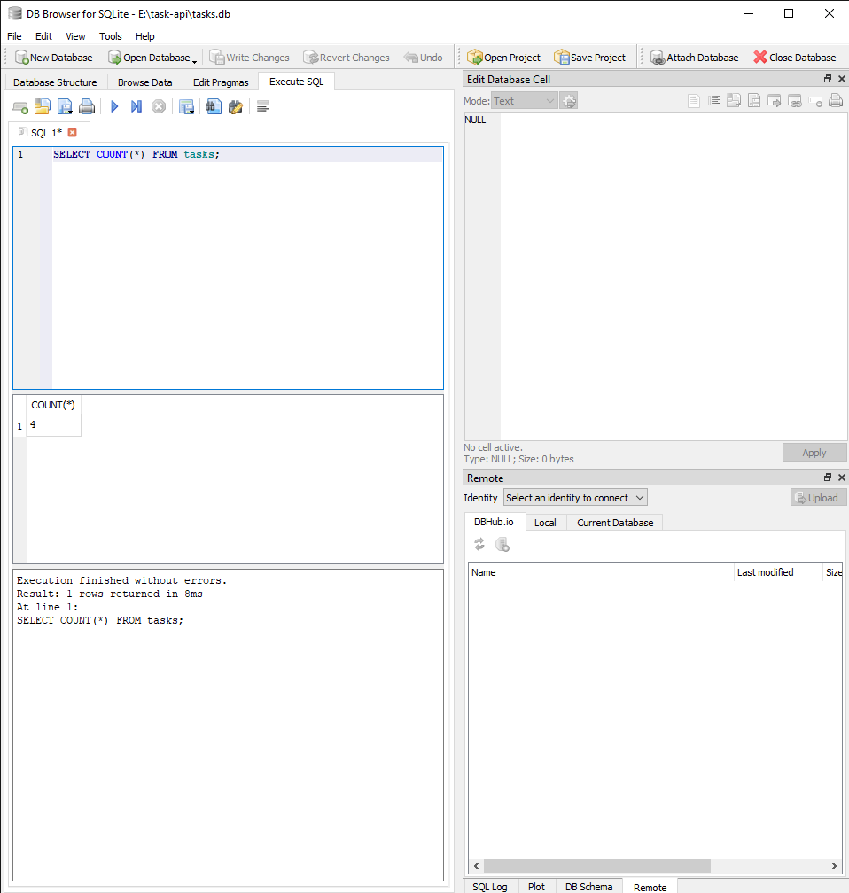

# Task API

A small CRUD API for managing a to-do list, built with FastAPI. Data is stored in PostgreSQL, running in Docker — it survives restarts of both the app and the database container.

## Run it

**Prerequisites:** Docker Desktop installed and running.

**1. Start Postgres in a container** (first time only — the volume `taskdata` keeps your data across restarts):
```bash
docker run --name taskdb -e POSTGRES_PASSWORD=dev -e POSTGRES_DB=tasks -p 5432:5432 -v taskdata:/var/lib/postgresql -d postgres
```

**2. Set up your environment:**
```bash
copy .env.example .env
```
(`.env` is git-ignored — it holds your real connection string. `.env.example` is the committed template.)

**3. Install dependencies and run the app:**
```bash
python -m venv venv
venv\Scripts\activate        # Windows
pip install -r requirements.txt
uvicorn main:app --port 8000 --reload
```

The app connects to Postgres on startup, creates the `tasks` table if it doesn't exist, and seeds 3 example tasks only if the table is empty.

Then open:
- API root: http://localhost:8000/
- Interactive docs (Swagger UI): http://localhost:8000/docs

## Why Postgres in Docker

- A real database server, not just a file — the same engine used behind most production backends.
- Docker means no local Postgres install, no version conflicts — the official `postgres` image behaves identically on any machine.
- A named Docker volume (`taskdata`) keeps the data even if the container is removed and recreated.
- Credentials live in `.env` (git-ignored), never hardcoded or committed — `.env.example` documents which keys are needed.

## Endpoints

| Method | Path              | Description                          | Success | Errors  |
|--------|-------------------|---------------------------------------|---------|---------|
| GET    | `/`               | API description                       | 200     | —       |
| GET    | `/health`         | Health check (also pings the database) | 200    | —       |
| GET    | `/tasks`          | List all tasks (supports `?done=` and `?search=`) | 200 | — |
| POST   | `/tasks`          | Create a task (`{"title": "..."}`)    | 201     | 400 (missing/empty title) |
| GET    | `/tasks/{id}`     | Get one task                          | 200     | 404 (not found) |
| PUT    | `/tasks/{id}`     | Update a task's title and/or done     | 200     | 400, 404 |
| DELETE | `/tasks/{id}`     | Delete a task                         | 204     | 404 |
| GET    | `/stats`          | Task counts (`total`, `done`, `open`) | 200     | — |
| POST   | `/reset`          | Reset to the 3 seed tasks             | 200     | — |

All CRUD operations use parameterized SQL queries (`%s` placeholders via `psycopg`) — no user input is ever glued directly into a SQL string.

## Example request

```
curl -i -X POST http://localhost:8000/tasks -H "Content-Type: application/json" -d "{\"title\":\"Buy milk\"}"
```

```
HTTP/1.1 201 Created
content-type: application/json

{"id":4,"title":"Buy milk","done":false}
```

## Postgres migration verified

- Connected the app to Postgres via `.env`/`DATABASE_URL`, confirmed the `tasks` table and 3 seed rows exist both through `GET /tasks` and directly via `psql` inside the container (Stage 1).
- Restarted the app 3 times — task count stayed at exactly 3 in Postgres, no duplicate seeding.
- Full CRUD cycle (create, update, delete) tested against Postgres with correct status codes (201, 200, 204, 404), confirmed via `GET /tasks` after each step (Stages 2-3).
- - Simulated a clean clone: wiped the Docker volume, removed the built image, deleted `.env`, recreated it from `.env.example`, and ran `docker compose up` from nothing. `GET /tasks` returned the 3 seeded tasks with fresh ids starting at 1 (Stage 5) — a stranger cloning this repo gets a working stack with zero manual database setup.

## Explored SQLite by hand (A2, historical)

Before this migration, the project used SQLite (`tasks.db`). The database was opened in DB Browser for SQLite and queried directly, confirming the API and browser shared the same live file with no restart needed:

```sql
SELECT * FROM tasks;
SELECT * FROM tasks WHERE done = 1;
SELECT COUNT(*) FROM tasks;
```



## Swagger UI

All endpoints listed and testable via "Try it out":


Full CRUD cycle tested through Swagger UI, including validation and error handling:

**Create (201)**


**Create with missing title (400)**


**Read unknown id (404)**


**Update (200)**


**Delete (204)**


## Extras implemented

Beyond the required CRUD endpoints, this API also includes:
- Filtering: `GET /tasks?done=true` (SQL `WHERE done = %s`)
- Search: `GET /tasks?search=milk` (SQL `ILIKE`)
- Stats: `GET /stats` → task counts, computed with SQL `COUNT(*)`
- Seed reset: `POST /reset` → restores the 3 example tasks
- `/health` also runs `SELECT 1` against the database and reports `db: "ok"` — the kind of check real deploys gate on

## Notes

- Data now lives in Postgres, inside a Docker volume — restarting the app or the container no longer wipes it. Call `POST /reset` any time to restore the 3 seed tasks.
- FastAPI's default validation returns 422 for missing required fields. Since the spec asks for 400 on invalid input, `title` is defined as optional in the schema and validated manually in the route, so a missing/empty title returns 400 instead of FastAPI's default 422.
- Error responses use the key `"detail"` (e.g. `{"detail": "Task 99 not found"}`), which is FastAPI's default convention for `HTTPException` — functionally the same as the `"error"` key shown in the assignment spec.
- Postgres 18's official image expects the volume mounted at `/var/lib/postgresql` (not `/var/lib/postgresql/data` as in older guides) — using the old path causes the container to fail on startup with a version-mismatch error.

## AI vs me (Stage 7 bonus, from A1)

See [ai-version/ai-vs-me.md](ai-version/ai-vs-me.md) for the full comparison between my hand-built API and an AI-generated version, including the rematch result.
