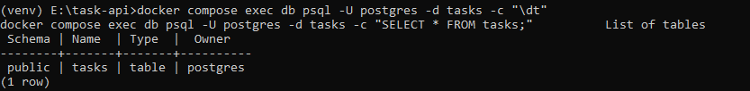
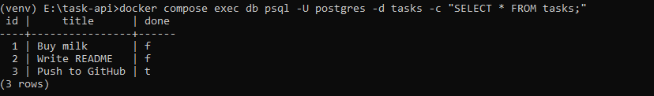
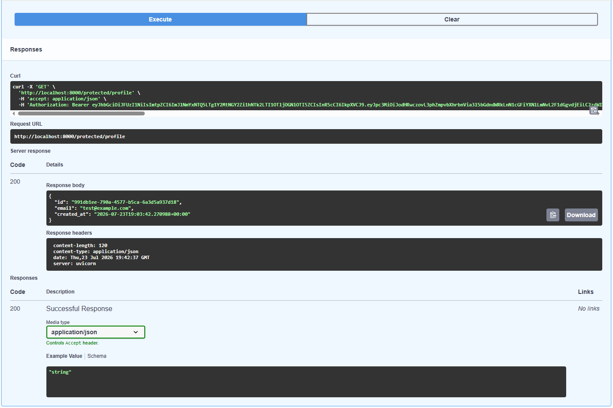
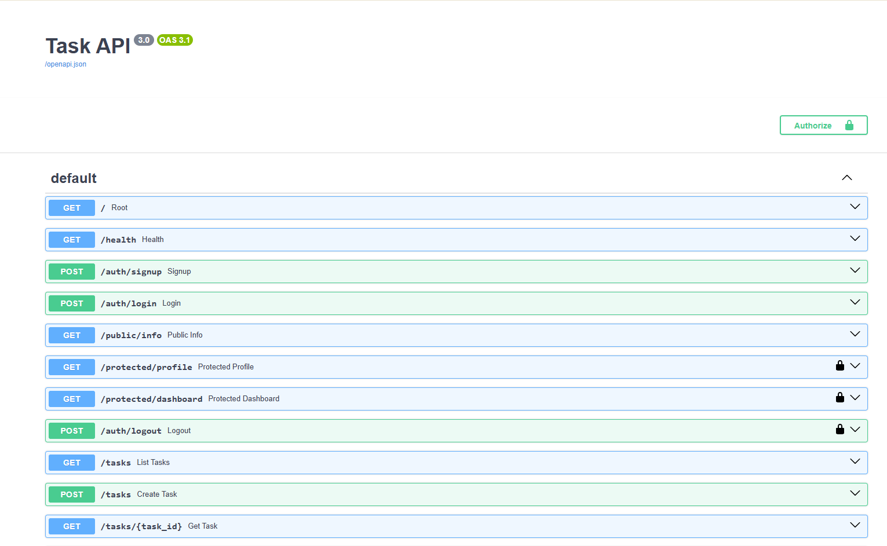

# Task API

A small CRUD API for managing a to-do list, built with FastAPI. Data is stored in PostgreSQL, running in Docker — it survives restarts of both the app and the database container. The API now also has authentication: sign up, log in, and log out are handled by Supabase Auth, and a reusable dependency guards protected routes with JWT bearer tokens.

## Run it

**Prerequisites:** Docker Desktop installed and running, and a free [Supabase](https://supabase.com) project.

**1. Set up your environment:**
```bash
copy .env.example .env
```
(`.env` is git-ignored — it holds your real connection string and Supabase credentials. `.env.example` is the committed template.)

Fill in `.env` with:
- `DATABASE_URL` — already set to the Docker Compose default, no change needed
- `SUPABASE_URL` and `SUPABASE_KEY` — from your Supabase project's **Project Settings → API** (use the **anon / public** key, never the `service_role` key)

**One-time Supabase setting:** in your Supabase project, go to **Authentication → Sign In / Providers → Email** and turn **off** "Confirm email". This lets a freshly signed-up test user log in immediately without clicking an email link — fine for local development, not something you'd do in production.

**2. Start the whole stack with one command:**
```bash
docker compose up
```
This builds the app image, starts Postgres, waits for it to be healthy, then starts the app. The app connects to Postgres and Supabase on startup, creates the `tasks` table if it doesn't exist, and seeds 3 example tasks only if the table is empty.

Then open:
- API root: http://localhost:8000/
- Interactive docs (Swagger UI): http://localhost:8000/docs

## Authentication

Auth follows a trust triangle between the client, this API, and Supabase (the Identity Provider):

1. **Sign up / log in** — the client sends `email` + `password` to this API's `/auth/signup` or `/auth/login`, which forward the credentials to Supabase. This API never hashes or stores a password itself.
2. **Token issued** — on successful login, Supabase returns a signed JWT (`access_token`) and a `refresh_token`.
3. **Authenticated request** — the client attaches the access token to protected routes as `Authorization: Bearer <token>`.
4. **Verification** — a reusable FastAPI dependency (`auth.get_current_user`, in `auth.py`) calls `supabase.auth.get_user(token)` on every protected route. Supabase checks the token's signature and expiry over the network; if it's missing, malformed, tampered with, or expired, the dependency raises `401` before the route body ever runs.

Because the guard is a dependency rather than code copy-pasted into each route, any new route becomes protected just by adding `user = Depends(get_current_user)` to its signature — see `/protected/dashboard` for an example that reuses it with zero additional auth code.

**Logout** works differently in this stateless setup than a typical session-based app: since the API holds no server-side session between requests, `/auth/logout` calls `supabase.auth.admin.sign_out(token, "global")`, which revokes that specific request's token directly with Supabase rather than relying on a locally cached session.

## Why Postgres in Docker

- A real database server, not just a file — the same engine used behind most production backends.
- Docker means no local Postgres install, no version conflicts — the official `postgres` image behaves identically on any machine.
- A named Docker volume (`taskdata`) keeps the data even if the container is removed and recreated.
- Credentials live in `.env` (git-ignored), never hardcoded or committed — `.env.example` documents which keys are needed.
- `api` waits for `db` to report healthy (via a `pg_isready` healthcheck) before starting — without this, the app can crash on a race condition where it tries to connect before Postgres has finished its first-time initialization.

## Endpoints

| Method | Path              | Description                          | Auth required | Success | Errors  |
|--------|-------------------|---------------------------------------|:---:|---------|---------|
| GET    | `/`               | API description                       | — | 200     | —       |
| GET    | `/health`         | Health check (also pings the database) | — | 200    | —       |
| POST   | `/auth/signup`    | Create a Supabase user account (`{"email": "...", "password": "..."}`) | — | 201 | 400 (missing fields), 400 (Supabase error, e.g. weak password) |
| POST   | `/auth/login`     | Authenticate & receive an access + refresh token | — | 200 | 400 (missing fields), 401 (invalid credentials) |
| GET    | `/public/info`    | Open, unauthenticated data             | — | 200 | — |
| GET    | `/protected/profile` | Read the caller's own profile (id, email, created_at) | ✅ Bearer | 200 | 401 (missing/invalid/expired token) |
| GET    | `/protected/dashboard` | Same guard as `/protected/profile`, demonstrates dependency reuse | ✅ Bearer | 200 | 401 |
| POST   | `/auth/logout`    | Revoke the caller's access token       | ✅ Bearer | 204 | 401 |
| GET    | `/tasks`          | List all tasks (supports `?done=` and `?search=`) | — | 200 | — |
| POST   | `/tasks`          | Create a task (`{"title": "..."}`)    | — | 201     | 400 (missing/empty title) |
| GET    | `/tasks/{id}`     | Get one task                          | — | 200     | 404 (not found) |
| PUT    | `/tasks/{id}`     | Update a task's title and/or done     | — | 200     | 400, 404 |
| DELETE | `/tasks/{id}`     | Delete a task                         | — | 204     | 404 |
| GET    | `/stats`          | Task counts (`total`, `done`, `open`) | — | 200     | — |
| POST   | `/reset`          | Reset to the 3 seed tasks             | — | 200     | — |

All CRUD operations use parameterized SQL queries (`%s` placeholders via `psycopg`) — no user input is ever glued directly into a SQL string.

## Example request

```
curl -i -X POST http://localhost:8000/tasks -H "Content-Type: application/json" -d "{\"title\":\"Buy milk\"}"
```

```
HTTP/1.1 201 Created
content-type: application/json

{"id":4,"title":"Buy milk","done":false}
```

## Data in Postgres

Confirmed directly inside the running container:

```bash
docker compose exec db psql -U postgres -d tasks -c "\dt"
```


```bash
docker compose exec db psql -U postgres -d tasks -c "SELECT * FROM tasks;"
```


## Postgres migration verified

- Connected the app to Postgres via `.env`/`DATABASE_URL`, confirmed the `tasks` table and 3 seed rows exist both through `GET /tasks` and directly via `psql` inside the container (Stage 1).
- Restarted the app 3 times — task count stayed at exactly 3 in Postgres, no duplicate seeding.
- Full CRUD cycle (create, update, delete) tested against Postgres with correct status codes (201, 200, 204, 404), confirmed via `GET /tasks` after each step (Stages 2-3).
- Brought up the whole stack with `docker compose up`, created a task, then ran a full `docker compose down` and `up` again — the task was still there, proving the volume keeps data across a complete teardown, not just a container restart (Stage 4).
- Simulated a clean clone: wiped the Docker volume, removed the built image, deleted `.env`, recreated it from `.env.example`, and ran `docker compose up` from nothing. `GET /tasks` returned the 3 seeded tasks with fresh ids starting at 1 (Stage 5) — a stranger cloning this repo gets a working stack with zero manual database setup.

## Explored SQLite by hand (A2, historical)

Before this migration, the project used SQLite (`tasks.db`). The database was opened in DB Browser for SQLite and queried directly, confirming the API and browser shared the same live file with no restart needed:

```sql
SELECT * FROM tasks;
SELECT * FROM tasks WHERE done = 1;
SELECT COUNT(*) FROM tasks;
```


## Swagger UI

All endpoints listed and testable via "Try it out":


Full CRUD cycle tested through Swagger UI, including validation and error handling:

**Create (201)**


**Create with missing title (400)**


**Read unknown id (404)**


**Update (200)**


**Delete (204)**


## Swagger UI — bearer authentication

Protected routes (`/protected/profile`, `/protected/dashboard`, `/auth/logout`) show a lock icon; public and auth-entry routes (`/public/info`, `/auth/signup`, `/auth/login`) do not:



After logging in via `/auth/login` and pasting the access token into the "Authorize" dialog, the padlock unlocks and protected routes can be called directly from the browser via "Try it out" — no curl needed:



## Extras implemented

Beyond the required CRUD endpoints, this API also includes:
- Filtering: `GET /tasks?done=true` (SQL `WHERE done = %s`)
- Search: `GET /tasks?search=milk` (SQL `ILIKE`)
- Stats: `GET /stats` → task counts, computed with SQL `COUNT(*)`
- Seed reset: `POST /reset` → restores the 3 example tasks
- `/health` also runs `SELECT 1` against the database and reports `db: "ok"` — the kind of check real deploys gate on

## Notes

- Data now lives in Postgres, inside a Docker volume — restarting the app or the container no longer wipes it. Call `POST /reset` any time to restore the 3 seed tasks.
- FastAPI's default validation returns 422 for missing required fields. Since the spec asks for 400 on invalid input, `title` is defined as optional in the schema and validated manually in the route, so a missing/empty title returns 400 instead of FastAPI's default 422.
- Error responses use the key `"detail"` (e.g. `{"detail": "Task 99 not found"}`), which is FastAPI's default convention for `HTTPException` — functionally the same as the `"error"` key shown in the assignment spec.
- Postgres 18's official image expects the volume mounted at `/var/lib/postgresql` (not `/var/lib/postgresql/data` as in older guides) — using the old path causes the container to fail on startup with a version-mismatch error.
- `depends_on` alone only waits for a container to *start*, not for the service inside it to be ready — a healthcheck (`pg_isready`) plus `condition: service_healthy` closes that gap so the app doesn't try to connect before Postgres is actually accepting connections.
- Python's `supabase.auth.sign_out()` only signs out a session the client library stored locally — but this API's Supabase client is one shared instance serving many different users' requests, so there's no per-request session to sign out of. `/auth/logout` instead calls `supabase.auth.admin.sign_out(token, "global")`, which sends that specific request's own token to Supabase's logout endpoint directly. This works with the anon key; it doesn't require the `service_role` key.
- FastAPI's `HTTPBearer` security scheme is used for the auth dependency (`auth.py`) instead of reading the `Authorization` header manually. Beyond simplifying the code, this is what makes Swagger UI's "Authorize" padlock appear automatically on protected routes with no extra OpenAPI configuration.

## AI vs me (Stage 7 bonus, from A1)

See [ai-version/ai-vs-me.md](ai-version/ai-vs-me.md) for the full comparison between my hand-built API and an AI-generated version, including the rematch result.
